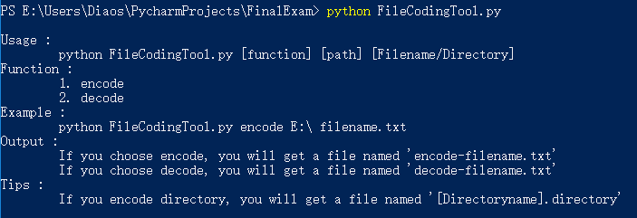

[TOC]
# 简易文件加密解密工具

## 1. 工具简介
该加密工具可以将Windows系统下的文件或文件夹进行加密和解密，密钥由用户自己输入。生成的加密后的文件可以通过该工具解密。

## 2. 引用的库
- random
- hashlib
- zipfile
- getpass
- sys
- os

## 3. 用法

用户可以在控制台使用 python 命令运行该工具，该工具接受三个参数：
1. [function]
   选择对文件的操作，encode 代表加密，decode代表解密
2. [path]
   加密文件所在的路径，例如： E:\
3. [Filename/Directory]
   需要加密文件的文件名或文件夹名

Tips：
如果选择加密文件夹，你将会获得一个后缀名为 directory 的文件，想要解密该文件夹则不能修改其后缀名！

## 4. 加密原理简介

### 1) 加密方式
使用用户输入的密钥对源文件的二进制流进行加密，加密方式为变种凯撒加密。
即使用用户输入的密钥的每一位字符的ASCII码值对二进制流中的每一位作移位处理，一位Key对应源文件二进制流中的一位，循环移位加密。

### 2) 密钥判别
对用户输入的密钥进行